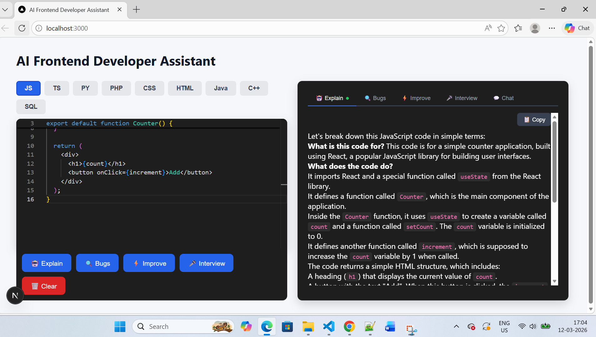

# 🤖 AI Developer Assistant

AI-powered Developer Assistant built with **Next.js** and **Groq AI** that helps developers analyze code, detect bugs, improve code quality, and generate interview questions across multiple programming languages.

---

## 🚀 Features

* 🧠 Explain code logic
* 🐞 Detect bugs in code
* ⚡ Suggest code improvements
* 🎯 Generate interview questions
* 💻 Supports multiple languages (JS, TS, Python, PHP, CSS, HTML, Java, C++, SQL)
* 🎨 Interactive code editor UI

---

## 🛠 Tech Stack

* Next.js
* React
* Groq AI API
* JavaScript
* CSS

---

## 📸 Screenshots

### Main Interface


### AI Code Analysis



----

## ⚙️ Installation

Clone the repository

```bash
git clone https://github.com/YOUR_USERNAME/ai-dev-assistant.git
```

Install dependencies

```bash
npm install
```

Run the development server

```bash
npm run dev
```

---

## 🔑 Environment Variables

Create `.env.local`

```
GROQ_API_KEY=your_api_key_here
```

---

## 🌟 Future Improvements

* Code execution
* Chat mode with AI
* Dark / Light theme
* Download analysis results
